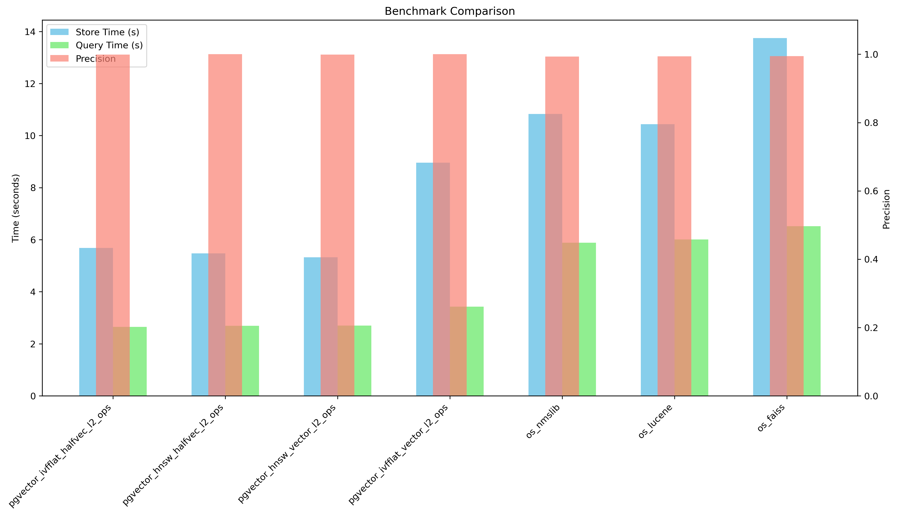

# pgvector vs OpenSearch benchmark

<p align="center">
  
</p>

A comparative speed and accuracy benchmark of pgvector and OpenSearch clusters for vector comparisons.

## Results

For 500 queries of 1000 vectors of dimension 2000 with accuracy@10 on an Intel Core i9-13900H machine :

```txt
Comparison                               Store Time (s)  Query Time (s)  Precision      
pgvector_hnsw_halfvec_l2_ops             5.68            2.65            0.9992         
pgvector_ivfflat_vector_l2_ops           5.47            2.69            1.0000         
pgvector_ivfflat_halfvec_l2_ops          5.32            2.70            0.9992         
pgvector_hnsw_vector_l2_ops              8.96            3.43            1.0000         
os_nmslib                                10.83           5.88            0.9936         
os_lucene                                10.44           6.01            0.9938         
os_faiss                                 13.75           6.52            0.9944
```



For 500 queries of 10000 vectors of dimension 2000 with accuracy@10 on an Intel Core i9-13900H machine :

```txt
Comparison                               Store Time (s)  Query Time (s)  Precision      
pgvector_ivfflat_halfvec_l2_ops          77.05           1.83            0.4134         
pgvector_hnsw_halfvec_l2_ops             77.08           1.95            0.4058         
pgvector_hnsw_vector_l2_ops              111.43          16.68           1.0000         
pgvector_ivfflat_vector_l2_ops           79.37           16.78           1.0000         
os_nmslib                                103.26          29.21           0.7628         
os_lucene                                99.72           29.38           0.7674         
os_faiss                                 130.39          31.20           0.7426 
```


Interpretation :

- Although pgvector looks a lot faster than OpenSearch, the latter allows querying through different algorithms after ingestion whereas pgvector requires declaring a predetermined one as index. However, OpenSearch looks less precise than its competitor.
- It is worth noting that OpenSearch supports vectors up to 10000 dimensions, which is a lot more than pgvector's 2000 to 4000 dims support.
- It is worth noting that OpenSearch might be a bit more complex to initially setup while pgvector might be more complex to tune.

Missing comparisons that should be benchmarked before choosing a solution : 1M and 10M vectors.

_Memory consumption was not compared (pgvector looks to consume less)._

## Supported algorithms

An HNSW index creates a multilayer graph. It has better query performance than IVFFlat (in terms of speed-recall tradeoff), but has slower build times and uses more memory.

An IVFFlat index divides vectors into lists and searches a subset of those lists that are closest to the query vector. It has faster build times and uses less memory than HNSW, but has lower query performance with respect to the speed-recall tradeoff[^1].

For pgvector :

- ivfflat
  - vector l2 (dim <=2000)
  - halfvec l2 (dim <=4000)
- hnsw
  - vector l2 (dim <=2000)
  - halfvec l2 (dim <=4000)

For OpenSearch :

- hnsw
  - lucene l2 (dim <= 10000)
  - nmslib l2 (dim <= 10000)
  - faiss l2 (dim <= 10000)

## Run the benchmark

### a. Start databases

Requirements: Python >= 3.8, libpq-dev

1. Clone

    ```bash
    git clone https://github.com/flavienbwk/pgvector-opensearch-benchmark
    cd pgvector-opensearch-benchmark
    ```

2. Start OpenSearch

    ```bash
    git clone https://github.com/flavienbwk/opensearch-docker-compose
    cd opensearch-docker-compose
    bash generate-certs.sh
    docker-compose up -d
    docker-compose exec os01 bash -c "chmod +x plugins/opensearch-security/tools/securityadmin.sh && bash plugins/opensearch-security/tools/securityadmin.sh -cd config/opensearch-security -icl -nhnv -cacert config/certificates/ca/ca.pem -cert config/certificates/ca/admin.pem -key config/certificates/ca/admin.key -h localhost"
    sudo sysctl -w vm.max_map_count=512000
    cd ..
    ```

3. Start pgvector

    ```bash
    docker compose -f pgvector.docker-compose.yml
    ```

4. Start benchmark

    ```bash
    python3 -m pip install -r requirements.txt
    python3 benchmark.py
    ```

# Interesting resources

- https://neon.tech/docs/extensions/pgvector#ivfflat
- https://medium.com/@zelal.gungordu/neural-search-on-opensearch-69d394495ab7
- https://opensearch.org/docs/latest/field-types/supported-field-types/knn-vector#lucene-byte-vector

[^1]: https://neon.tech/docs/extensions/pgvector#hnsw
